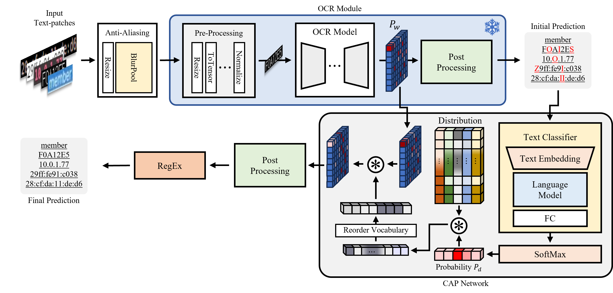

# CAP
CAP (Context-Aware Prior) is ~~~

## Method
  

## Results
<h3>CAP-BiLSTM Model trained with FINE data</h3>  

OCR Libries | Normal | HASH | IPv4 | IPv6 | MAC 
---- | ---- | ---- | ---- | ---- | ----
[ASTER*](https://github.com/open-mmlab/mmocr/blob/dev-1.x/configs/textrecog/aster/README.md) | +0.27 | +9.95 | -3.64 | +1.7 | +0.96 
[CLIP4STR-B](https://github.com/VamosC/CLIP4STR) | +0.56 | +1.67 | +0.01 | +1.58 | +0.95
[CLIP4STR-L](https://github.com/VamosC/CLIP4STR) | +0.60 | +1.31 | +0.02 | +1.45 | +2.03
[CLOVA](https://github.com/clovaai/deep-text-recognition-benchmark) | +0.03 | -0.13 | -3.73 | -0.67 | -0.15
[EasyOCR](https://github.com/JaidedAI/EasyOCR) | -0.20 | +11.69 | +22.08 | +10.29 | +9.13
[MAERec-B*](https://github.com/open-mmlab/mmocr/blob/dev-1.x/configs/textrecog/maerec/README.md) | +0.06 | +4.08 | -0.01 | +3.70 | +6.52
[MAERec-S*](https://github.com/open-mmlab/mmocr/blob/dev-1.x/configs/textrecog/maerec/README.md) | +0.25 | +5.28 | -0.06 | +5.31 | +6.61
[MASTER*](https://github.com/open-mmlab/mmocr/blob/dev-1.x/configs/textrecog/master/README.md) | -0.24 | +3.52 | -1.73 | +0.85 | +0.63
[NRTR*](https://github.com/open-mmlab/mmocr/blob/dev-1.x/configs/textrecog/nrtr/README.md) | +0.07 | +8.09 | +1.80 | +2.13 | +2.75
[PaddleOCR](https://github.com/PaddlePaddle/PaddleOCR) | +0.15 | +1.28 | +0.07 | +3.02 | +0.35
[RobustScanner*](https://github.com/open-mmlab/mmocr/blob/dev-1.x/configs/textrecog/robust_scanner/README.md) | +0.40 | +12.39 | +11.98 | +7.64 | +4.62
[SATRN*](https://github.com/open-mmlab/mmocr/blob/dev-1.x/configs/textrecog/satrn/README.md) | +1.21 | +12.13 | +1.46 | +5.53 | +2.34
**Average** | **+0.21** | **+6.45** | **+2.25** | **+4.71** | **+2.99**

The OCR models marked with an **asterisk\*** were tested using models implemented using the [MMOCR library](https://github.com/open-mmlab/mmocr).

<h3>CAP-BERT Model trained with FINE data</h3>  

OCR Libries | Normal | HASH | IPv4 | IPv6 | MAC 
---- | ---- | ---- | ---- | ---- | ----
[ASTER*](https://github.com/open-mmlab/mmocr/blob/dev-1.x/configs/textrecog/aster/README.md) | +0.27 | +11.31 | -2.86 | +3.74 | +0.97
[CLIP4STR-B](https://github.com/VamosC/CLIP4STR) | +0.27 | +0.95 | +0.01 | +0.80 | +0.90
[CLIP4STR-L](https://github.com/VamosC/CLIP4STR) | +0.32 | +0.92 | +0.02 | +0.93 | +0.89
[CLOVA](https://github.com/clovaai/deep-text-recognition-benchmark) | +0.03 | -0.15 | -3.69 | -0.74 | -0.15
[EasyOCR](https://github.com/JaidedAI/EasyOCR) | -1.86 | +14.05 | +22.45 | +19.19 | +11.80
[MAERec-B*](https://github.com/open-mmlab/mmocr/blob/dev-1.x/configs/textrecog/maerec/README.md) | +0.06 | +4.13 | -0.01 | +3.74 | +6.51
[MAERec-S*](https://github.com/open-mmlab/mmocr/blob/dev-1.x/configs/textrecog/maerec/README.md) | +0.25 | +5.41 | -0.06 | +5.33 | +6.61
[MASTER*](https://github.com/open-mmlab/mmocr/blob/dev-1.x/configs/textrecog/master/README.md) | -0.24 | +3.55 | -1.26 | +1.98 | +0.62
[NRTR*](https://github.com/open-mmlab/mmocr/blob/dev-1.x/configs/textrecog/nrtr/README.md) | +0.06 | +8.86 | +3.43 | +2.67 | +2.74
[PaddleOCR](https://github.com/PaddlePaddle/PaddleOCR) | +0.09 | +1.31 | +0.07 | +3.03 | +0.35
[RobustScanner*](https://github.com/open-mmlab/mmocr/blob/dev-1.x/configs/textrecog/robust_scanner/README.md) | +0.40 | +12.63 | +11.19 | +8.10 | +4.43
[SATRN*](https://github.com/open-mmlab/mmocr/blob/dev-1.x/configs/textrecog/satrn/README.md) | +1.21 | +13.07 | +3.87 | +5.74 | +2.31
**Average** | **+0.07** | **+6.34** | **+2.76** | **+4.54** | **+3.17**

The OCR models marked with an **asterisk\*** were tested using models implemented using the [MMOCR library](https://github.com/open-mmlab/mmocr).
